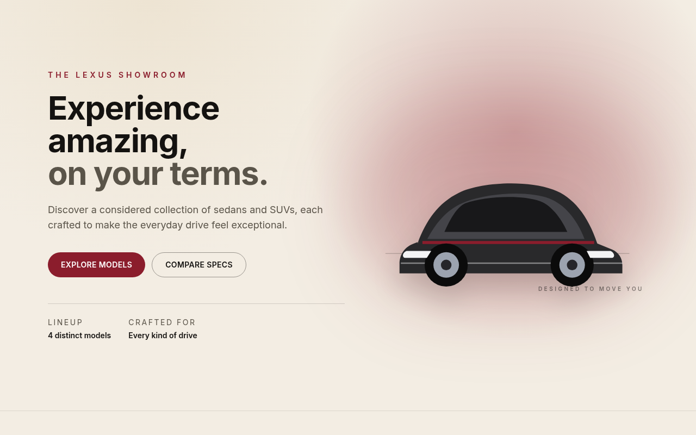
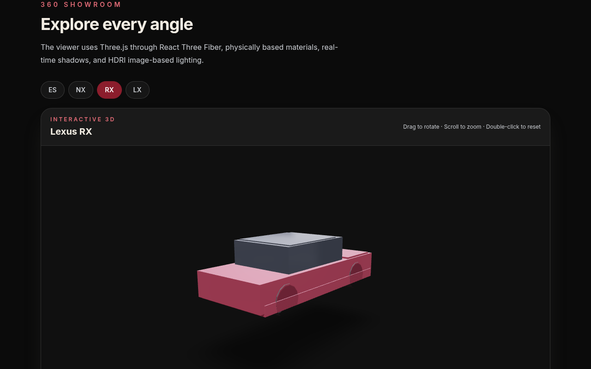

# Lexus Showroom

A React + TypeScript single-page showroom site featuring the Lexus ES, NX, RX,
and LX lineup — built with Vite and Tailwind CSS.

## Screenshots

| Home (light) | Model route `#rx` (dark) |
| ------------ | ------------------------ |
|  |  |

Theme comparison (full-page): [`theme-light.png`](docs/screenshots/theme-light.png) · [`theme-dark.png`](docs/screenshots/theme-dark.png). Regenerate with `node scripts/capture-readme-screenshots.mjs` (and `scripts/capture-theme-screenshots.mjs`) against `npm run preview` on port 4173.

## Stack

- [Vite](https://vitejs.dev/) — build tool and dev server
- [React](https://react.dev/) + TypeScript
- [Tailwind CSS](https://tailwindcss.com/) — styling

## Brand theme

Lexus-inspired tokens only — this project does **not** ship official Lexus
logos, wordmarks, or other trademarked assets (no license). The palette is an
original ebony / cream / champagne / graphite feel plus the existing accent
red.

Tokens live as CSS variables in `src/index.css` (space-separated RGB so
Tailwind opacity modifiers work) and are mapped in `tailwind.config.js`.

| Token | Role | Light | Dark |
| ----- | ---- | ----- | ---- |
| `canvas` | Page background | cream `#f3ede3` | ebony `#0b0b0b` |
| `surface` | Cards / panels | champagne `#faf6ee` | charcoal `#1a1a1a` |
| `ink` | Primary text | ebony `#141210` | cream `#f3ede3` |
| `muted` | Secondary text | graphite `#5a5449` | silver `#c9ccd1` |
| `line` | Borders | ebony @ 10–25% | white @ 10–25% |
| `accent` | Fills / selected | `#8b1d2c` | `#8b1d2c` |
| `accent-bright` | Small accent text | `#8b1d2c` (AA on cream) | `#e06b76` (AA on ebony) |

Type and spacing tokens: `font-sans` / `font-display`, `tracking-brand` /
`tracking-kicker`, `spacing.gutter` (`1.5rem`), `spacing.section` (`5rem`),
`spacing.section-lg` (`7rem`). Navbar, Hero, CarCard, and Footer consume these
semantic tokens so both themes stay aligned.

### Light and dark mode

- **Default** follows `prefers-color-scheme` (dark when unknown).
- **Navbar toggle** forces light or dark and persists in `localStorage`
  (`lexus-showroom-theme`).
- **Class-based:** `html.dark` / `html.light`. An inline script in
  `index.html` applies the class before first paint to avoid a flash.
- Helpers: `src/theme.ts`.

Screenshots: [`docs/screenshots/theme-light.png`](docs/screenshots/theme-light.png)
and [`docs/screenshots/theme-dark.png`](docs/screenshots/theme-dark.png).

## Project structure

```
src/
  components/   Navbar, Hero, Button, CarCard, LazyShowroom3D, SpecTable, LeadForm, Footer
  data/         vehicles.ts — typed vehicle data (edit this to change/add models)
  leadForm.ts   Lead validation + Formspree/mailto submit helpers
  prefersReducedMotion.ts  OS reduced-motion helper + React hook
  theme.ts      Light/dark preference + class application
  App.tsx       Page layout wiring the components together
```

Vehicle data in `src/data/vehicles.ts` uses 2026 MY entry-trim specs and
MSRP + DPH from Lexus USA Newsroom press materials. The UI labels this as
approximate / demo comparison data — not a dealer quote. Update that file to
refresh models.

## 3D models

`LazyShowroom3D` code-splits `CarShowroom3D` (Three.js / React Three Fiber /
drei) and mounts the WebGL canvas only on intent — the **Load 3D view**
button — or when the showroom section scrolls near the viewport. That keeps
the initial JS/CSS path lean and avoids blocking first paint with the 3D
stack or GLB fetch.

GLBs load from `public/models` via `import.meta.env.BASE_URL`
(`/lexus-showroom/` on GitHub Pages). Each lineup vehicle maps to
`models/{id}.glb` (`es`, `nx`, `rx`, `lx`) and falls back to the bundled
`models/hero.glb`. See `public/models/README.md` for naming and asset rules.
The viewer shows load progress, a WebGL fallback, and an error state if no
GLB is available. When the OS has `prefers-reduced-motion: reduce`, auto-orbit
and control damping pause so the canvas stays still until the user interacts
(see Accessibility below).

## Lineup stills

Each lineup card (`CarCard`) uses a distinct per-model still under
`public/stills/` with `srcset` (1x + `@2x`) and `alt` from `vehicle.name`.
Placeholders are original SVG silhouettes / gradient cards — **not** official
Lexus photos. See `public/stills/README.md` for filenames and budgets. Broken
URLs swap to a labeled fallback so the card never silently blanks. The
marketing `Hero` keeps its decorative inline SVG (not a per-model still).

## Asset size budgets

| Asset | Budget | Notes |
| ----- | ------ | ----- |
| Initial JS (entry + CSS-adjacent chunks, gzip) | ≤ ~180 KB | Hero + lineup + specs; **no** Three/R3F |
| 3D viewer chunk (lazy, gzip) | ≤ ~450 KB | Loaded only after intent / near-viewport |
| Shared `hero.glb` | ≤ 200 KB | Bundled placeholder is ~18 KB today |
| Per-vehicle `.glb` | ≤ 5 MB preferred; hard cap 15 MB | Mobile delivery; prefer Draco/Meshopt |
| Texture maps | ≤ 2K for most surfaces | 4K only for critical exterior detail |
| Per-model still (1x / 2x) | ≤ 25 KB / ≤ 50 KB | SVG placeholders ~1.7 KB; see `public/stills/` |

### Recompressing GLBs (follow-up)

Binary recompression is optional for the current low-poly `hero.glb`. When
adding licensed models:

```bash
# Example with gltf-transform (install separately — not a repo dependency)
npx @gltf-transform/cli optimize public/models/es.glb public/models/es.glb \
  --compress draco --texture-size 2048
```

Document the before/after sizes in the PR that adds each asset. PR CI also
runs a Lighthouse budget on the Pages home (see below).

## Lead form (no CRM)

The Contact section (`#contact`) captures name, email, and model interest
(ES / NX / RX / LX) with client-side validation and success/error messaging.

Configure the sink with a **public** Vite env var (safe to expose in the Pages
bundle — never put API secrets here):

| Variable | Purpose |
| -------- | ------- |
| `VITE_LEAD_ENDPOINT` | HTTPS Formspree-style form URL (e.g. `https://formspree.io/f/xxxx`). When unset, the form opens a pre-filled `mailto:showroom-leads@example.com` instead. A `mailto:` value is also accepted as the recipient. |

Local example:

```bash
# optional — Formspree (or compatible) public endpoint
export VITE_LEAD_ENDPOINT="https://formspree.io/f/your-form-id"
npm run dev
```

For GitHub Pages builds, set `VITE_LEAD_ENDPOINT` as a repository Actions
variable/secret that is passed into the build step if you want the HTTPS sink
in production; otherwise the mailto fallback is used.

Helpers live in `src/leadForm.ts` (unit-tested). The UI is `src/components/LeadForm.tsx`.


## Contributing

New contributors should be able to add a fifth lineup model from this section alone. Open improvement ideas live on GitHub:

- [Open issues](https://github.com/jnibarger01/lexus-showroom/issues?q=is%3Aissue+is%3Aopen)

### Prerequisites

- **Node.js 20** (LTS used in CI — see `.github/workflows/pr-ci.yml`). Node 20+ works locally.
- `npm install` once after clone.

### Scripts

| Script | Purpose |
| ------ | ------- |
| `npm run dev` | Vite dev server |
| `npm run build` | Typecheck + production build → `dist/` |
| `npm run typecheck` | `tsc -b --noEmit` |
| `npm test` | Vitest unit tests |
| `npm run test:e2e` | Playwright smoke (build + preview under `/lexus-showroom/`) |
| `npm run test:perf` | Lighthouse + gzip budget on Pages home |

Also useful: `npm run preview`, `npm run test:a11y`, `npm run test:e2e:ui`.

### Add a fifth vehicle

Catalog entries live in `src/data/vehicles.ts` and are validated by `parseVehicleCatalog` in `src/data/vehicleSchema.ts`. Required fields per vehicle:

| Field | Notes |
| ----- | ----- |
| `id` | Unique slug (hash route `#id`, lead form value) |
| `name` | Display name (also `img` alt) |
| `bodyStyle` | One of: `Sedan`, `Compact SUV`, `SUV`, `Full-Size SUV` |
| `tagline`, `description` | Non-empty copy |
| `startingPrice` | Positive MSRP (+ DPH) number |
| `accentColor` | CSS color string |
| `modelUrl` | Prefer `vehicleModelUrl("id")` |
| `stillSrc` / `stillSrcSet` | Prefer `vehicleStillSrc` / `vehicleStillSrcSet` |
| `modelRotation` | `[x, y, z]` radians tuple |
| `specs` | `engine`, `horsepower`, `zeroToSixty`, `mpgCombined`, `seating`, `cargoCapacity`, `drivetrain` |

Steps:

1. **Stills** — add `public/stills/{id}.svg` and `public/stills/{id}@2x.svg` (see `public/stills/README.md` for sizes/budgets). Register them in `VEHICLE_STILL_FILES`.
2. **Optional GLB** — add `public/models/{id}.glb` and register in `VEHICLE_MODEL_FILES`. If missing, the viewer falls back to `public/models/hero.glb`.
3. **Catalog** — append a `Vehicle` object to the `vehicles` array in `src/data/vehicles.ts` (copy an existing entry and edit). Keep `id` unique.
4. **Lead form allow-list** — add the new `id` to `LEAD_MODEL_IDS` in `src/leadForm.ts` (the `<select>` already maps over `vehicles`).
5. **Navbar** — add `{ label, href: "#id" }` to the model links in `src/components/Navbar.tsx`.
6. **Verify** — `npm run typecheck && npm test && npm run build`. Optionally `npm run test:e2e` and `npm run test:perf`.

Lineup cards, compare, body-style filters, and `#id` model routes pick up new catalog rows automatically once the steps above are done.

## Local development

```bash
npm install
npm run dev
```

Requires Node.js 20+ (see **Contributing**). Vite prints the URL (typically
`http://localhost:5173`).

## Type checking

```bash
npm run typecheck
```

## Accessibility

- **Skip link:** first focusable control is “Skip to content” (`a.skip-link` → `#main-content`). It stays visually hidden until focused, then appears fixed at the top-left.
- **`prefers-reduced-motion`:** `src/index.css` collapses CSS transitions/animations and disables smooth scrolling. Programmatic section scrolls in `App` use `behavior: "auto"` when reduced motion is on. The 3D viewer (`CarShowroom3D`) turns off OrbitControls `autoRotate` and inertial `enableDamping` via `usePrefersReducedMotion()` so the canvas stays static until the user drags (there is no GSAP on this site).

```bash
npm run test:a11y
```

Runs a Vitest + axe-core smoke check on the home page (3D viewer mocked).
Contrast for brand accent text is handled via the `accent-bright` token (darker on cream, brighter on ebony).
Unit coverage for the motion helper lives in `src/prefersReducedMotion.test.ts`.

## Playwright smoke (Pages base path)

CI runs a Chromium smoke against the **production preview** served under
`base: /lexus-showroom/` so a broken Vite base or missing entry JS/CSS fails
the PR job.

```bash
npm run build
npx playwright install chromium   # once per machine / after Playwright upgrades
npm run test:e2e
```

Refresh notes:

- If the repo (and Pages subpath) is renamed, update `base` in
  `vite.config.ts` **and** the `BASE` constant in `e2e/home-smoke.spec.ts`
  plus `playwright.config.ts` to match.
- After bumping `@playwright/test`, re-run `npx playwright install chromium`
  (CI uses `npx playwright install --with-deps chromium`).
- Spec lives in `e2e/home-smoke.spec.ts`; extend there for extra critical
  selectors — keep it a smoke, not a full suite.

## Lighthouse budget (Pages home)

CI runs one desktop Lighthouse performance pass against the **production
preview** at `http://127.0.0.1:4173/lexus-showroom/` (same Vite `base` as
GitHub Pages), plus a gzip size check on the initial (non-lazy) JS/CSS.
A huge unused **sync** script in the entry bundle fails the JS budget with a
readable table. The lazy 3D chunk is not part of the initial JS budget.

```bash
npm run build
npx playwright install chromium   # once — Lighthouse reuses Playwright Chromium
npm run test:perf
```

Budgets live in `lighthouse-budget.json` (edit there if a genuine, documented
regression needs more headroom):

| Check | Budget | Notes |
| ----- | ------ | ----- |
| Entry JS gzip | ≤ 180 KB | Same as the asset table above; **no** Three/R3F |
| Entry CSS gzip | ≤ 40 KB | Initial stylesheet |
| LCP | ≤ 4000 ms | Desktop preset; first paint, not the WebGL canvas |
| TBT | ≤ 600 ms | Slightly lenient for shared CI runners |

`test:perf` starts `vite preview` if nothing is already listening on 4173,
writes `lighthouse-report.json` (gitignored), and prints PASS/FAIL rows.
Override the browser with `CHROME_PATH` if you do not have Playwright
Chromium. The 3D viewer still lazy-loads (#9); this budget does not replace
that split.

## Production build

```bash
npm run build
```

Outputs a static site to `dist/`. Preview the production build locally with:

```bash
npm run preview
```

## Deployment (GitHub Pages)

This repo includes a GitHub Actions workflow
(`.github/workflows/pages.yml`) that builds the site and deploys `dist/` to
GitHub Pages automatically on every push to `main`.

One-time setup in the GitHub repo settings:

1. Go to **Settings → Pages**.
2. Under **Build and deployment → Source**, select **GitHub Actions**.

After that, pushing to `main` (or running the workflow manually via
**Actions → Deploy Vite site to GitHub Pages → Run workflow**) will publish
the site to `https://<username>.github.io/lexus-showroom/`.

**Note:** `vite.config.ts` sets `base: "/lexus-showroom/"` to match this
repo's name, since GitHub Pages serves project repos from a subpath. If the
repo is ever renamed, update `base` to match.
